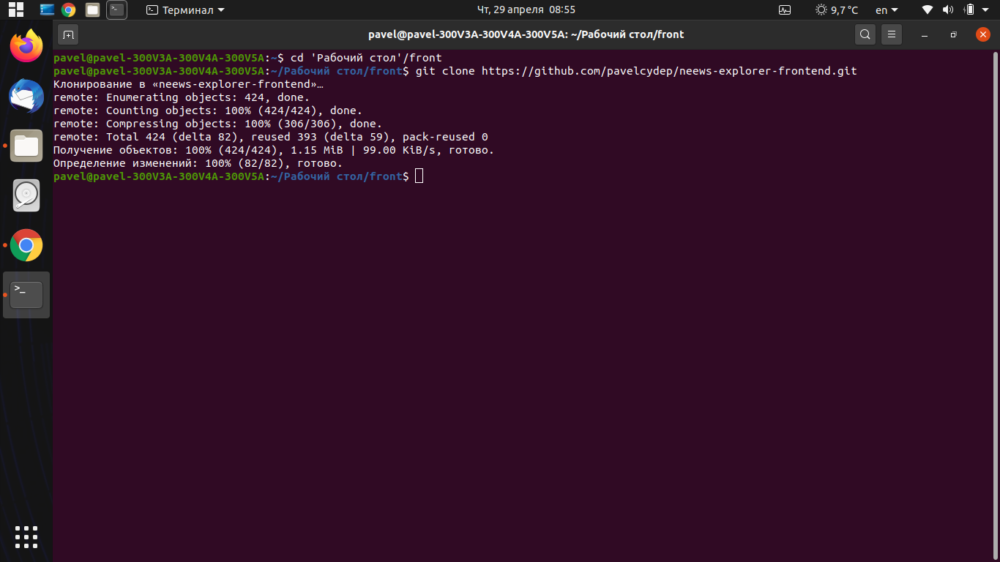
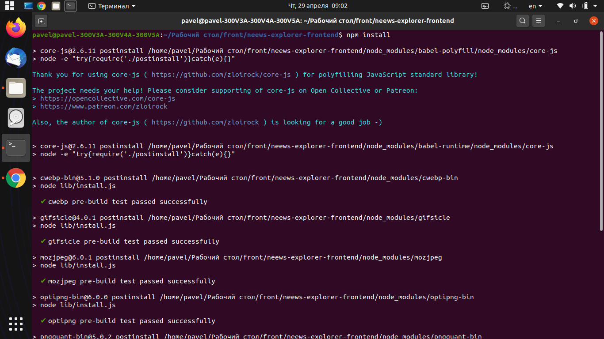
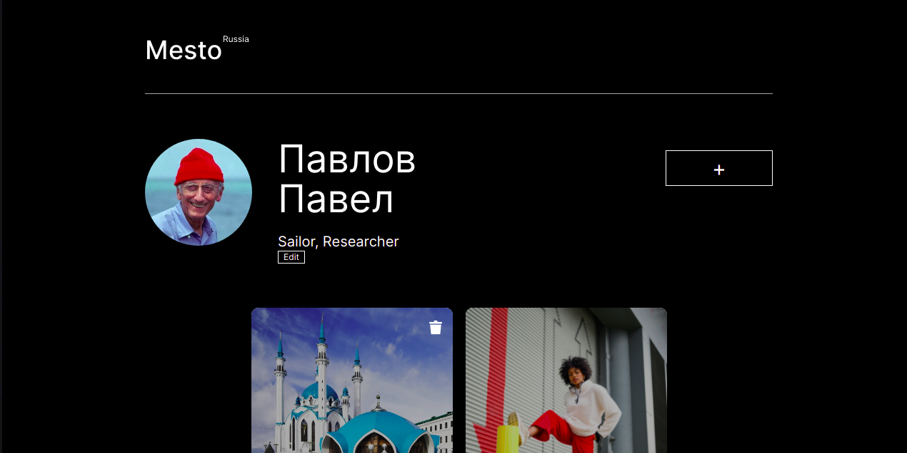

    

## О сервисе Mesto

**_Mesto_** - это интерактивная страница, где люди делятся фотографиями их любимых мест.
А также оценивают фотографии других пользователей.

Ссылка на страницу проекта:  https://pavelcydep.github.io/servis-mesto-fetch/

## Для начала работы вам необходим:

- <a href="https://nodejs.org/en/">NodeJS & npm<a> - среда выполенния кода JavaScript вне браузера. Позволяет писать серверный код для динамических веб-страниц и веб-приложений.
- <a href="https://gitforwindows.org/">Git Bash<a> если вы используете Windows OS.

## Установка

Склонировать проект на ПК:

    git clone https://github.com/pavelcydep/servis-mesto-fetch.git

Установить зависимости

    npm install

## Работа

#### Запуск демо:

    npm run dev
    
Это приведет к запуску локального сервера доступного по ссылке http://localhost:8080/, все файлы будут компилироваться в режиме разработки.

#### Для сборки проекта в production:

    npm run build
    
#### Для деплоя на GitHub pages:

    npm run deploy
### Планы по доработке
Создать это приложение с помощью  React.

